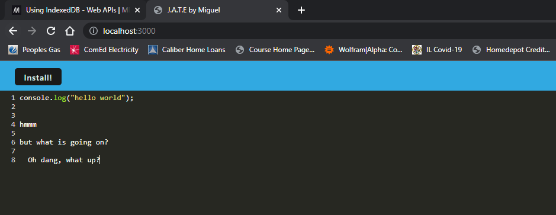
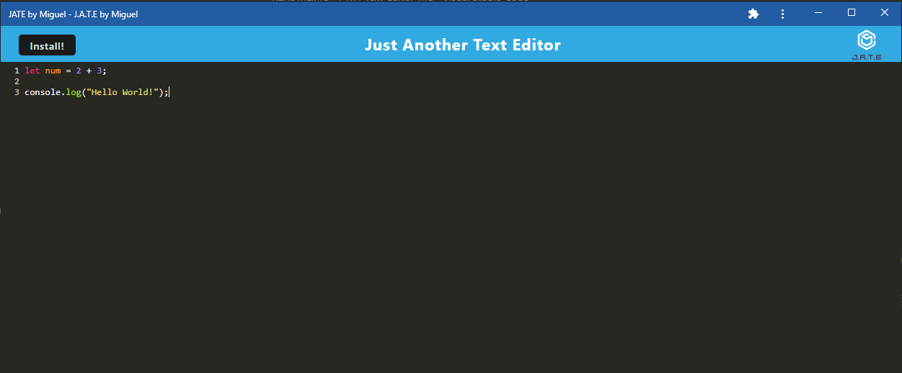

# JATE by Miguel
## Description
  
This program was created by mae2136. If you have any questions on how this program works, please reach out to me at mae2136@gmail.com.

This project is just another text editor, this time by Miguel. It allows you to type in javascript style in the browser. Code was split into a client-server model, and has progressive web app (pwa) capabilities. It can also run offline with the use of a service worker, and stores data using IndexedDB.
  
## Table of Contents
  
- [Installation] (#installation)
- [Usage] (#usage)
- [Credits] (#credits)
- [Contributing] (#contributing)
- [License] (#license)
  
## Installation
  
Installation Instructions: npm i
  
## Usage
  
Open up the program at the following link: 
  
[JATE by Miguel]()
  
The program will look like the following in the browser:

Installing the pwa with the install button allows you to run the JATE program from your desktop, or your phone. It looks like the following:

      
## Contributing
  
Fork from my github to contribute.

## Credits
  
I would like to credit my wife for putting up with my ramblings, as well as Trilogy Education services at Northwestern University for teaching me the skills needed to code this pwa.
## License
  
MIT License

Copyright (c) 2022 Miguel Escobar

Permission is hereby granted, free of charge, to any person obtaining a copy
of this software and associated documentation files (the "Software"), to deal
in the Software without restriction, including without limitation the rights
to use, copy, modify, merge, publish, distribute, sublicense, and/or sell
copies of the Software, and to permit persons to whom the Software is
furnished to do so, subject to the following conditions:

The above copyright notice and this permission notice shall be included in all
copies or substantial portions of the Software.

THE SOFTWARE IS PROVIDED "AS IS", WITHOUT WARRANTY OF ANY KIND, EXPRESS OR
IMPLIED, INCLUDING BUT NOT LIMITED TO THE WARRANTIES OF MERCHANTABILITY,
FITNESS FOR A PARTICULAR PURPOSE AND NONINFRINGEMENT. IN NO EVENT SHALL THE
AUTHORS OR COPYRIGHT HOLDERS BE LIABLE FOR ANY CLAIM, DAMAGES OR OTHER
LIABILITY, WHETHER IN AN ACTION OF CONTRACT, TORT OR OTHERWISE, ARISING FROM,
OUT OF OR IN CONNECTION WITH THE SOFTWARE OR THE USE OR OTHER DEALINGS IN THE
SOFTWARE.
